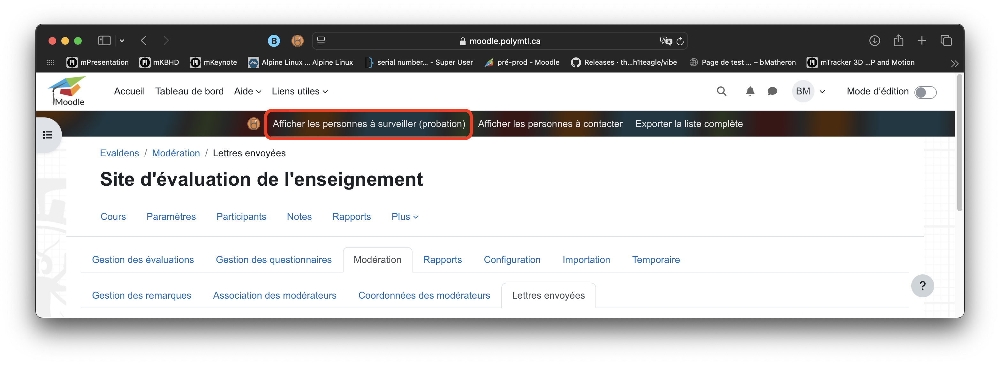

# Documentation de l'éxtension&nbsp;BAIP&nbsp;Utilitaire
- [Documentation de l'éxtension BAIP Utilitaire](#documentation-de-léxtensionbaiputilitaire)
  - [Installation](#installation)
    - [Safari ](#safari-)
    - [Firefox ](#firefox-)
  - [Introduction](#introduction)
- [Gestion des évaluations](#gestion-des-évaluations)
  - [Liste des évaluations](#liste-des-évaluations)
  - [Génération des évaluation en masse](#génération-des-évaluation-en-masse)
- [Modération](#modération)
  - [Afficher les personnes à surveiller](#afficher-les-personnes-à-surveiller)
  - [Afficher les personnes à contacter](#afficher-les-personnes-à-contacter)
  - [Exporter la liste complète](#exporter-la-liste-complète)
- [Rapports](#rapports)
  - [Remplissage automatique](#remplissage-automatique)
  - [Rechercher les meilleurs rapports](#rechercher-les-meilleurs-rapports)
  - [Modification d'un rapport](#modification-dun-rapport)
  - [Aperçu d'un rapport](#aperçu-dun-rapport)
- [Importation](#importation)
  - [Importation papier en masse](#importation-papier-en-masse)
## Installation

### Safari  
[Cliquez sur ce lien pour installez la version Safari](https://apps.apple.com/ca/app/utilitaire-baip/id6608989166?mt=12 "Apple AppStore")

Dans l'App Store, cliquez sur le bouton de téléchargement  pour installer l'extension sur votre mac et l'intégrer dans Safari.

Pour vérifier la bonne intégration de l'extension au navigateur.  

Depuis Safari, cliquez sur "Safari"  puis "Paramètres".  

Dirigez-vous vers le menu "Extensions" et assurez-vous que l'extension est cochée/active et que vous autorisez l'extension à fonctionner dans une fenêtre privée.  

### Firefox  

[Cliquez sur ce lien pour installez la version firefox](https://addons.mozilla.org/fr/firefox/addon/baip-utilitaire/ "Gestionnaire d'extension Firefox")

Depuis la page du gestionnaire d'extensions de Firefox, cliquez sur "Ajouter à Firefox"  

Puis, lorsque que Firefox vous affiche un menu popup, cochez "Exécuter l'extension dans les fenêtres privées" puis "Ajouter".  

## Introduction

Le fonctionnement de l'extension est comme suivant:
- Si une action est possible via l'extension, vous trouverez une barre d'action foncée contenant ce logo (Voir image ci-dessous)

- Il existe deux type d'actions:
  - Le téléchargement direct (exemple: la récupération d'un affichage sous forme de tableau au format CSV). Dans ce cas il vont suffit de cliquer et votre navigateur vous proposera d'enregistrer le fichier à l'endroit de votre choix (firefox) ou le téléchargera dans l'emplacement de téléchargement par défaut (Safari)(contexte semblable à l'image précédente)
  - L'action par réglage (exemple: la récupération de l'historique d'une personne enseignante). Dans ce cas ci une zone de paramétrage apparaitra au clic juste en dessous de la barre d'actions BAIP Utilitaire. (Voir exemple ci-dessous)

# Gestion des évaluations

## Liste des évaluations
À partir de l'onglet "Liste des évaluations" vous pouvez, en cliquant sur "Télécharger la liste des évaluations", télécharger la liste telle qu'affichée dans le navigateur avec les paramètres suivants:
- Extension: CSV
- Séparateur: ";"
- Encodage: UTF-8

## Génération des évaluation en masse

À partir de l'onglet "Création manuelle d'une évaluation" vous pouvez, en cliquant sur le bouton "Génération des évaluations en masse" faire apparaitre une zone de dépôt déstinée à acceuillir un fichier contenant toutes les évaluations à créer pour un trimestre donné.

Vous pouvez directement déposer un fichier en "drag and drop" dans la zone désignée. Le format à réspecter est :
- Extension: CSV
- Encodage: UTF-8
- le fichier doit réspecté le schema de colonnes obtenu depuis la requête impromptue

Une fois déposé...

Le contenu du fichier est analysé et la zone d'édition est alors remplacée par un visuel de paramétrage.
Le seul paramètre est le trimestre dans lequel vous souhaitez créer les évaluations.  
Une fois séléctionné, vous pouvez cliquer sur le bouton "Générer les X évaluations".

Si le processus est un succès vous aurez alors un message disant que tout c'est bien passé comme suivant. (sinon une erreur apparaitra)

# Modération

## Afficher les personnes à surveiller

À partir de l'onglet "Lettres envoyées" vous pouvez afficher toutes les personnes n'ayant qu'une première lettre problématique sur la periode paramétrée.  
En cliquant sur "Afficher les personnes à surveiller (probation)".

Puis en paramétrant le trimestre depuis lequel vous voulez COMMENCER l'analyse et en cliquant sur "Rechercher".

Vous afficherez une nouvelle colonne "A surveiller" au tableau des lettres envoyée. 

## Afficher les personnes à contacter

À partir de l'onglet "Lettres envoyées" vous pouvez afficher toutes les personnes ayant deux lettres problématiques consécutives sur la periode paramétrée.  
En cliquant sur "Afficher les personnes à contacter".  

Puis en paramétrant le trimestre depuis lequel vous voulez COMMENCER l'analyse et en cliquant sur "Rechercher".

Vous afficherez une nouvelle colonne "A contacter" au tableau des lettres envoyée. 

Sur chaque ligne où l'enseignant est concerné par la recherche vous verrez apparaitre un nouveau label "A contacter".   

En cliquant sur ce nouveau label, vous aurez accès à l'historique des lettres données à l'enseignant sur la période de la recherche paramétrée à travers une popup comme suivant

Pour fermer cette popup, cliquez sur le bouton "fermer" en bas de popup. (Le clic extérieur ne fonctionnera pas dans ce cas ci)

## Exporter la liste complète

À partir de l'onglet "Lettres envoyées" vous pouvez télécharger la liste complète des enseignants ayant une lettre associée a un rapport sur la periode paramétrée.  
En cliquant sur "Exporter la liste complète".  

Vous téléchargerez la liste suivant ces paramètres:
- format HTML
- encodage UTF-8

Vous pourrez l'ouvrir dans un lecteur de feuilles de style tel que Numbers ou Excel. (N'oubliez pas, une fois ouvert dans l'éditeur, de le sauvegarder dans le format natif de l'éditeur (.numbers, .xls ou .xlsx))

# Rapports

## Remplissage automatique

À partir de l'onglet "Rapports individuels" vous pouvez, en cliquant sur le bouton "Remplissage automatique", enregistrer automatiquement les lettres bleus ou vertes sur le trimestre en cours.  

Une fois la zone de paramétrage apparue vous pouvez séléctionner le type de lettre que vous souhaitez remplir automatiquement et cliquer sur "enregistrer" pour lancer le processus.

## Rechercher les meilleurs rapports

À partir de l'onglet "Rapports individuels" vous pouvez, en cliquant sur le bouton "Rechercher les meilleurs rapports", vous pouvez télécharger la liste des rapports correspondant a votre filtrage de régérence.

Une fois le bouton cliqué, une zone d'édition du filtrage apparait.  

Cette zone comprend:
- un paramètre de type nombre pour le taux minimal de réponses.
- un paramètre de type nombre pour le taux D'ACCORD minimal sur chaque item du rapport parcouru.

En cliquant sur rechercher, l'extension analysera chaque rapport du trimestre en cours et fournira un bouton de téléchargement contenant les rapports concernés.

## Modification d'un rapport

Dans le cadre d'une modification de rapport, trois opérations se produise via l'extension:  

- L'affichage de la présélection de la lettre en matière couleur.
  
- Le filtrage des lettres dispenssables selon l'utilisateur connécté.
  
- L'auto-remplissage de la requête associée au rapport
  

Depuis la barre d'action BAIP Utilitaire, vous pouvez également, en cliquant sur le bouton "Afficher l'historique", afficher l'historique des lettres de l'enseignant liée au rapport en cours d'édition.

Une zone d'édition apparait alors pour vous laisser choisir depuis quel trimestre la recherche doit démmarer.

Cliquez ensuite sur "Rechercher" puis patientez le temps de la recherche.

Une fois la recherche terminée, un nouvelle affichage apparait à côté du résumé de l'évaluation de l'enseignant sous la forme suivante:

(Une liste ordonée selon trimestre | lettres obtenues dans ce trimestre sous forme de points)

Notez également qu'il est possible de télécharger cet historique au format suivant:
- format HTML
- encodage UTF-8
- ouvrable dans une éditeur de feuille de style (Numbers ou Excel)
## Aperçu d'un rapport

Dans le cadre d'un aperçu de rapport synthèse ou d'ensemble, un bouton "Télécharger le rapport d'ensemble au format HTML (Ouvrable avec Excel ou Numbers)" vous est proposé afin de télécharger le visuel en cours selon ce paramètres:
- format HTML
- encodage UTF-8
- ouvrable dans n'importe quel éditeur de feuilles de style.

# Importation

## Importation papier en masse

Depuis l'onglet "Formulaires papier" vous pouvez, en cliquant sur le bouton "Importation papier en masse" de la barre d'action de BAIP Utilitaire, procéder à l'importation des formulaires papiers acquis depuis le scan Remark Office OMR.

Pour ce faire vous pouvez glisser/déposer un ou plusieurs fichers exportées en HTML depuis Remark Office OMR dans la zone prévue à cet effet puis cliquer sur "Importer"
Le/Les ficher(s) doivent respecter les paramètres suivants:
- Format HTML (exporté depuis Remark Office OMR)
- encogage Windows-1252 (aussi Western-1252)

L'extension s'occupe de traiter les différents types de formulaires selon leurs propres caractéristiques connues.